# Chapter 7. Webpack 소개 및 배포 자동화
### 학습목표
- Webpack의 역할에 대해 이해한다
- IAM 역할, 정책, 사용자, 그룹에 대해 이해한다
- CLI를 사용해 S3 Bucket에 만들어진 HTML, CSS, JS 파일을 배포해본다

# 1. 컴포넌트가 여러개?
  - 자바스크립트(브라우저)는 원래 모듈을 지원하지 않음
  - require 소개
  - import / export (ES6) 소개
  - npm 소개
  - Webpack이란? (개념)
  - 본격적으로 Vue Project 시작해보기 (Vue CLI로 Scaffolding)
> [참고] 본 세션에서는 Vue CLI와 함께 `egoist/vuepack` 템플릿을 사용합니다.
  
> [참고] 현재(2월 22일 기준) Vue CLI는 3.0-alpha가 최신입니다. (TypeScript를 사용하실 예정이라면, Vue CLI 3을 사용하시는 것을 추천합니다)

# 2. Dependency 설치
- macOS 환경이신 경우 `Terminal.app`, Windows 환경이신 경우 `cmd`를 열어주세요.
> [참고] 스크린샷과 보이는 모습이 다를 수 있습니다. (해당 스크린샷은 zsh 환경입니다)


- 처음에 다운로드 한 폴더 내의 `ausg-seminar-2018/TrendyWebDev/7_webpack/ausg-vue-app`으로 이동합니다 (`cd` 명령어를 이용하세요)


- 아래의 명령어를 입력해주세요 (반드시 Node.js가 설치되어 있어야 합니다)

```
npm install
```

> `npm install` 명령어는 해당 폴더내에 `package.json`에 포함된 모든 필요한 패키지를 `node_modules` 폴더에 설치합니다. 

> [참고] 저는 `npm` 대신 `yarn`을 사용합니다. 고양이가 귀엽거든요! (두 개의 차이점은 거의 없다고 보시면 됩니다)

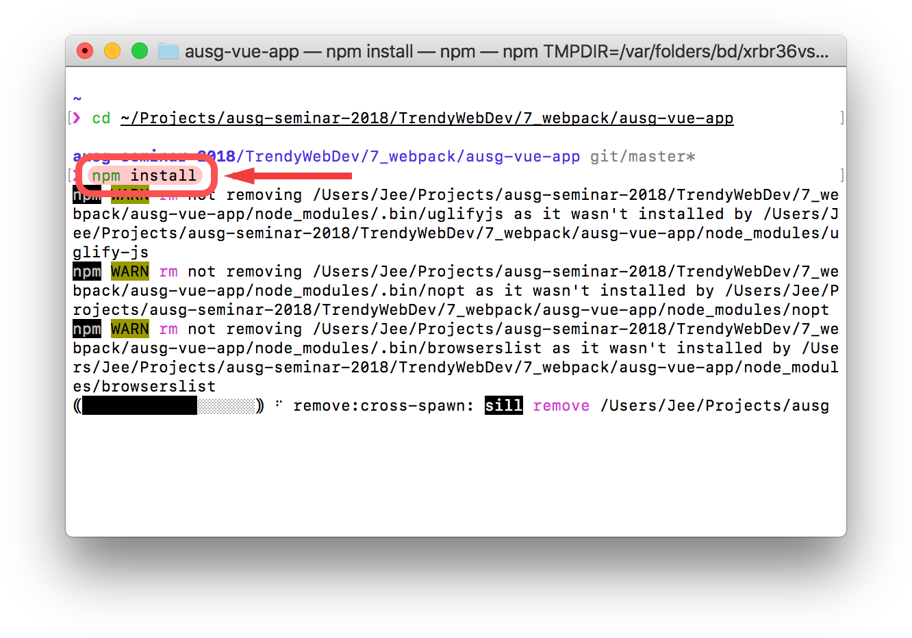
- 설치가 완료되면 해당 폴더를 코드 에디터(Atom, VS Code 등)으로 열어봅니다.
- 폴더 구조 설명
  - `build` 폴더 안에는 빌드를 위해 필요한 Webpack 설정이 들어있습니다
  - `client` 폴더 안에는 우리가 앱을 제작할 소스가 들어있습니다.
  - `node_modules` 폴더 안에는 NPM 패키지들이 들어있습니다.
  - `static` 폴더 안에는 정적으로 호스팅 할 이미지 등을 넣으시면 됩니다.

# 3. 개발 서버 작동하기
- 먼저 한번 어떤 앱인지 확인해볼까요? 개발 서버를 띄워보겠습니다. 아래의 명령어를 터미널(CMD)에 입력해주세요

```
npm run dev
```

> 참고) `npm run *` 명령어는 `package.json` 파일 내부에 `scripts` 속성에 가시면 새롭게 정의하거나 수정 할 수 있습니다.


- 성공하셨나요? 그렇다면, `http://localhost:4000`으로 이동해봅니다. [이동](http://localhost:4000)
> 참고) 이 개발 서버는 수정 사항이 있을 때마다, 자동으로 새로고침 해줍니다.

# 4. 간단히 수정해보기

- 수정 진행... (준비중)

# 5. 빌드
- 이제 빌드 해보겠습니다. 아래의 명령어를 터미널(CMD)에 입력해주세요. 우리의 앱을 html, css, js 파일로 이루어진 정적 파일로 빌드해줍니다.

```
npm run build
```

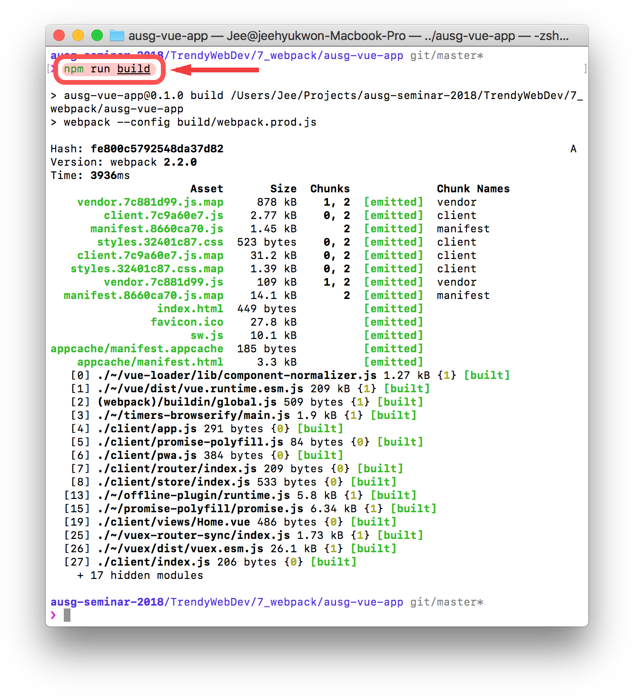
- 빌드가 끝나셨으면, `dist` 폴더가 생긴 모습을 확인 할 수 있는데요, 이 폴더 내부에 정적 파일들이 저장됩니다.

# 6. 직접 S3에 업로드
- AWS Console로 이동합니다
- S3 서비스로 이동
- 전에 만든 버킷으로 이동합니다

### [주의] 반드시 Chrome 또는 Firefox에서 작업하세요! (IE에서는 Drag and Drop 기능이 제공되지 않습니다)

- dist 폴더 내부의 파일들을 Drag and Drop으로 끌어 놓습니다

- '업로드' 클릭
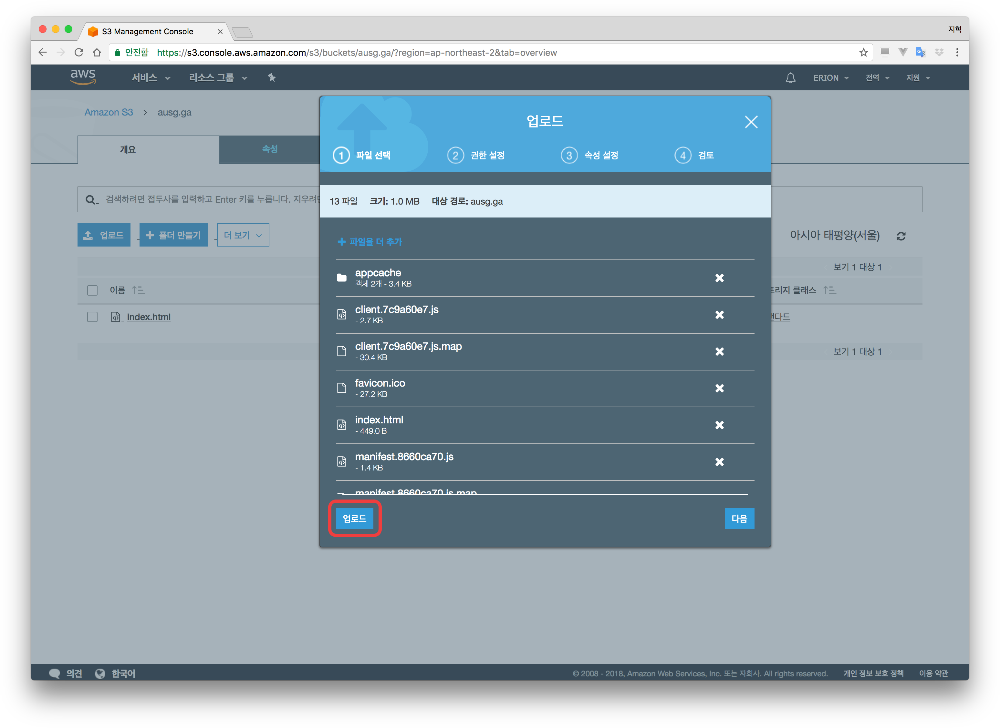
- 도메인 이름으로 가서 변경 내용을 확인해보세요

# 7. webpack-s3-plugin를 통한 빌드 시 S3에 자동 업로드 세팅
- macOS 환경이신 경우 `Terminal.app`, Windows 환경이신 경우 `cmd`를 열어주세요.
- 아래의 명령어를 입력하세요
> NPM을 이용해 Webpack s3 Plugin을 설치하는 과정입니다. `--save-dev` flag를 사용하면 설치한 내역을 package.json의 `devDependencies`항목에 적어넣습니다.

```bash
npm install --save-dev git+https://github.com/hyukio/s3-plugin-webpack.git
```
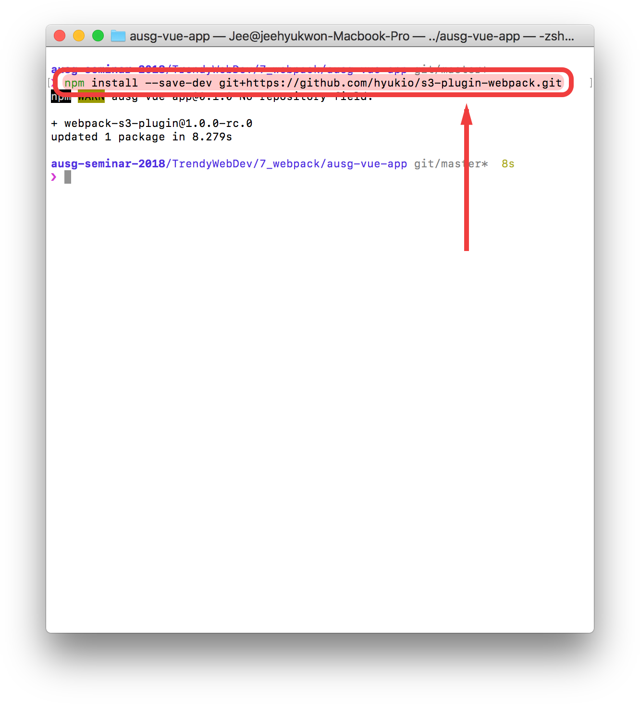

- `ausg-vue-app/build/webpack.prod.js` 파일을 열어봅니다.
- 최상단 선언부분 (각종 `require`문 들) 에 다음 내용을 추가합니다
> 이 코드는 방금 설치한 `webpack-s3-plugin`을 js 파일 내에서 변수로 사용 할 수 있도록 해줍니다.

```js
const S3Plugin = require('webpack-s3-plugin')
```


- 65번째 줄 뒤에 쉼표(,)를 붙인 후, 65와 66번째 줄 사이에 다음 코드를 삽입합니다.

```js
new S3Plugin({
  s3Options: {
    accessKeyId: '액세스키를여기에넣습니다',
    secretAccessKey: '시크릿액세스키를여기에넣습니다',
    region: 'ap-northeast-2',
  },
  s3UploadOptions: {
    Bucket: '버킷이름을여기에넣습니다',
  },
})
```
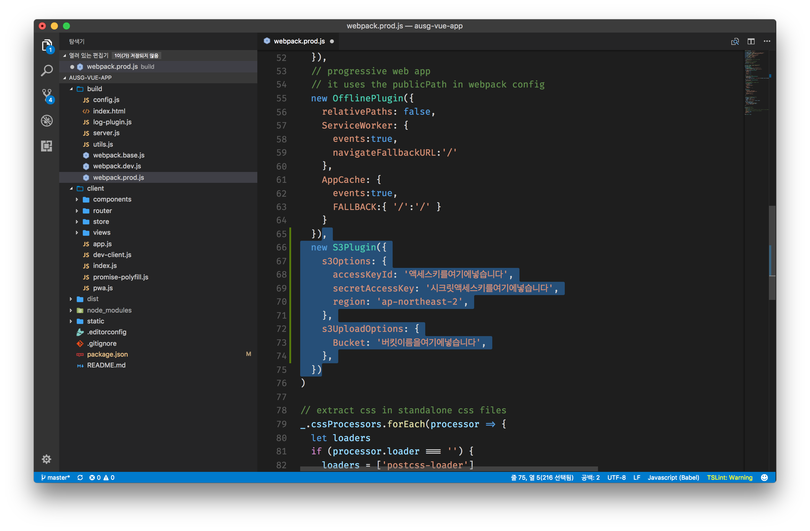

- 이 플러그인을 멋지게 작동시키려면 S3 접근 권한을 가진 `Access Key`와 `Secret Access Key`가 필요합니다

# 8. AWS IAM에서 Access Key와 Secret Access Key 발급받기
- AWS Console로 이동
- AWS IAM으로 이동
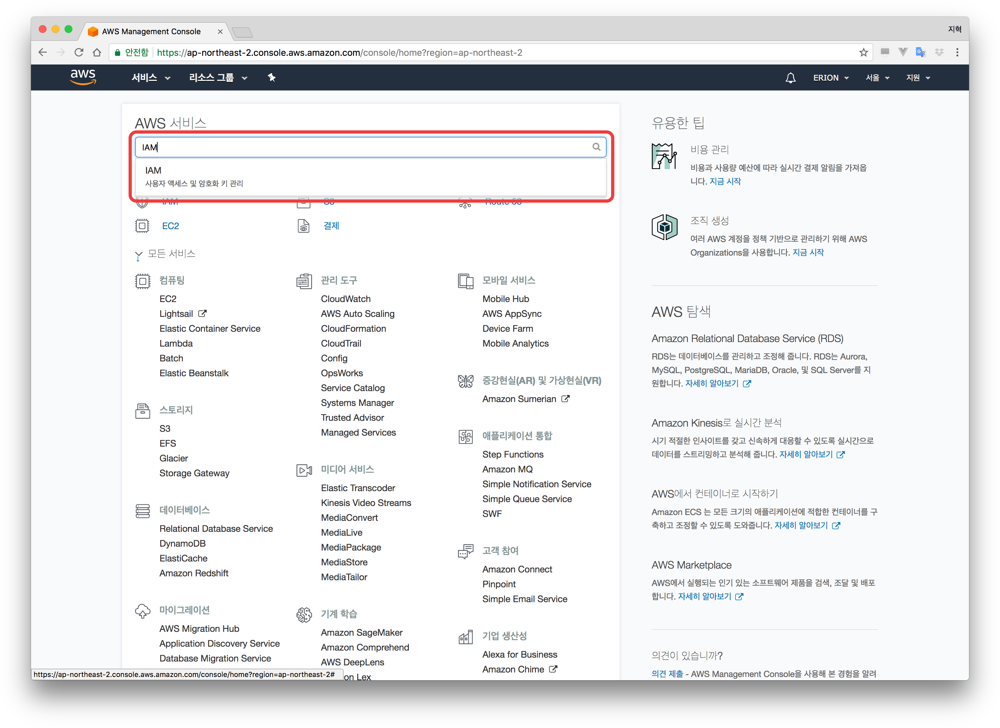
- '사용자' 메뉴로 이동합니다
- '사용자 추가' 클릭
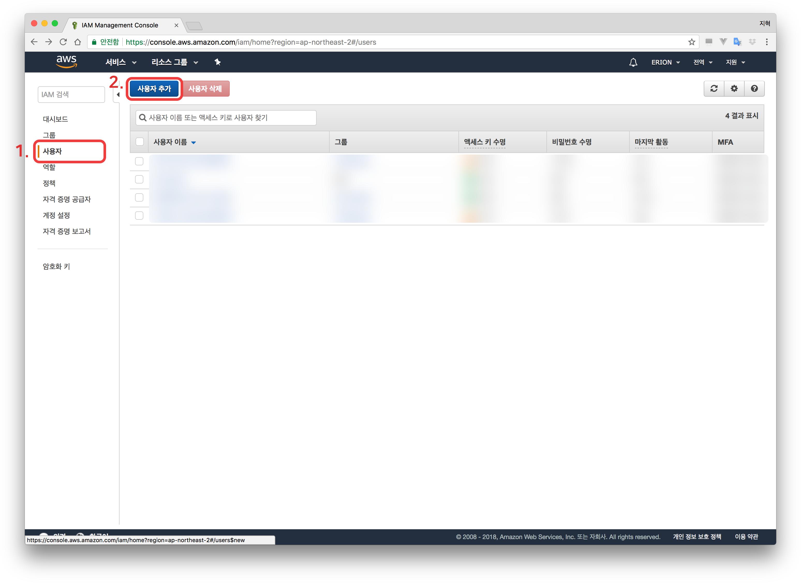
- '사용자 이름'에 `ausg-webpack-s3`를 입력합니다. (자유롭게 작성하셔도 괜찮습니다)
- '프로그래밍 방식 액세스'에 체크합니다
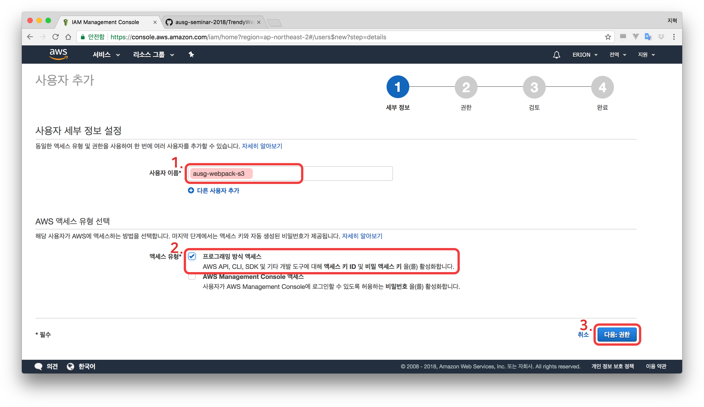
- '기존 정책 직접 연결' 클릭
- 검색폼에 `s3` 입력
- `AmazonS3FullAccess`를 선택합니다
- '검토' 클릭
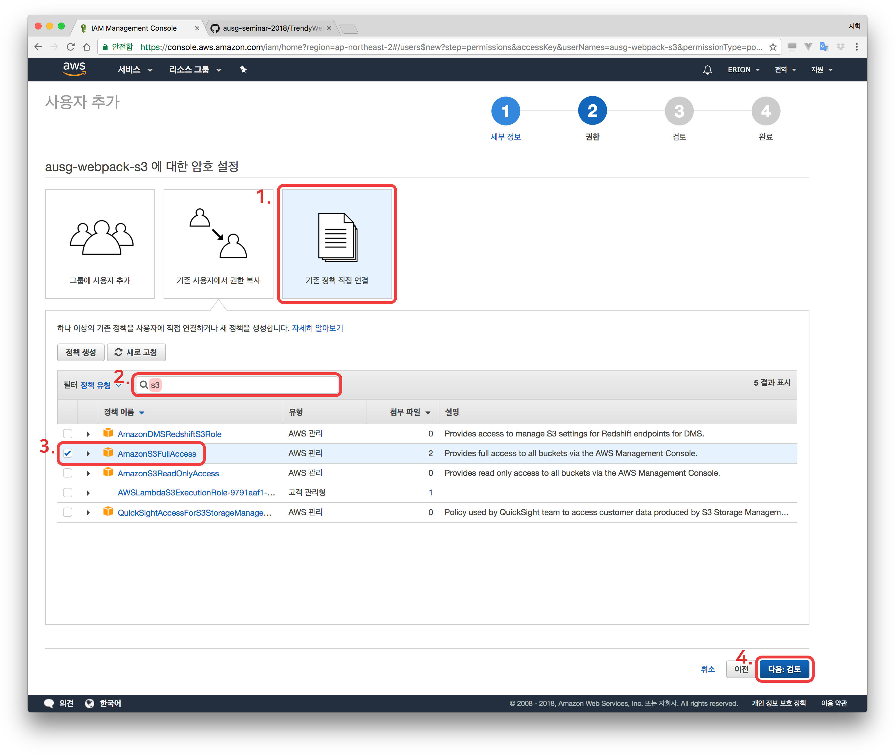
- 만든 내용을 검토하세요
- '사용자 만들기' 클릭
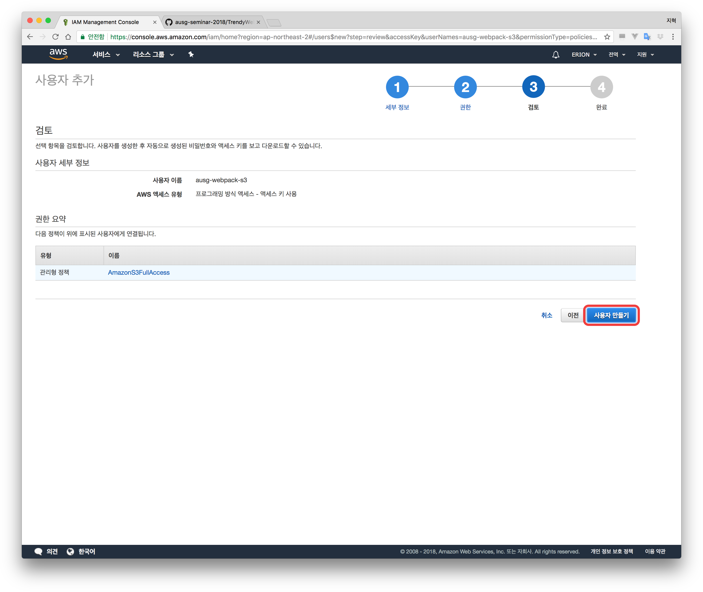
### [주의] 이 Access Key와 Secret Access Key가 유츨 될 시에, S3에 대한 모든 권한이 마찬가지로 노출됩니다. 반드시 조심히 관리하세요 (이 가이드는 개인에게 해당 문제가 발생 할 시 책임을 지지 않습니다)
- Access Key와 Secret Access Key가 생성되었습니다
> Secret Access Key는 해당 화면을 나가는 동시에 다시 확인 할 수 없습니다. 안전한 장소에 복사하여 저장하세요

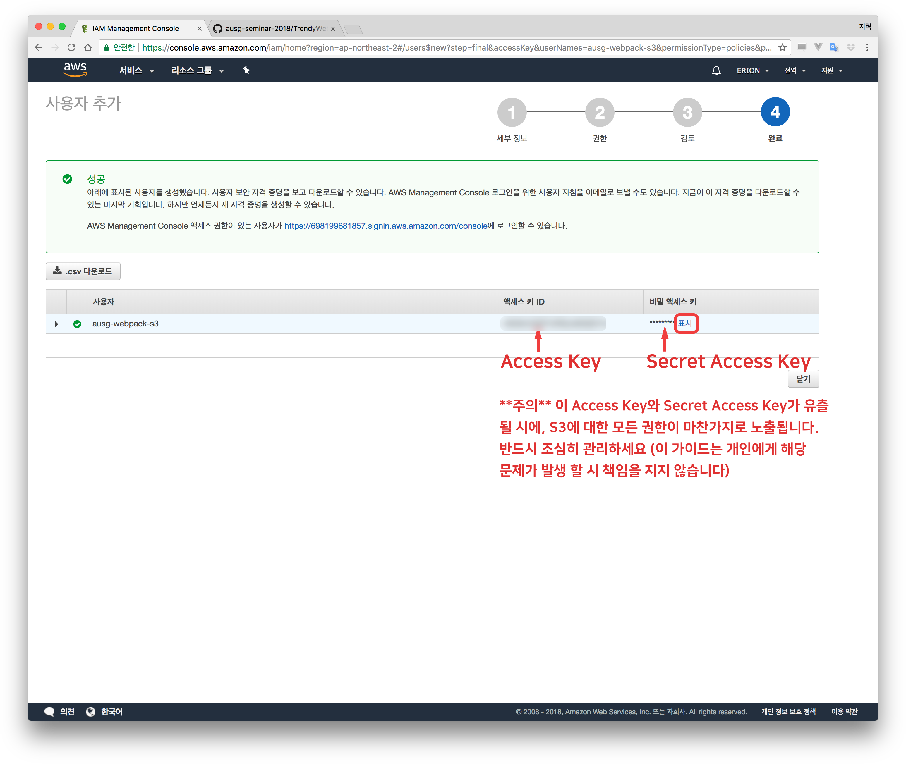

- 에디터로 돌아와서, 해당 Access Key와 Secret Access Key를 `webpack.prod.js`내 플러그인 옵션에 붙여 넣어줍니다.
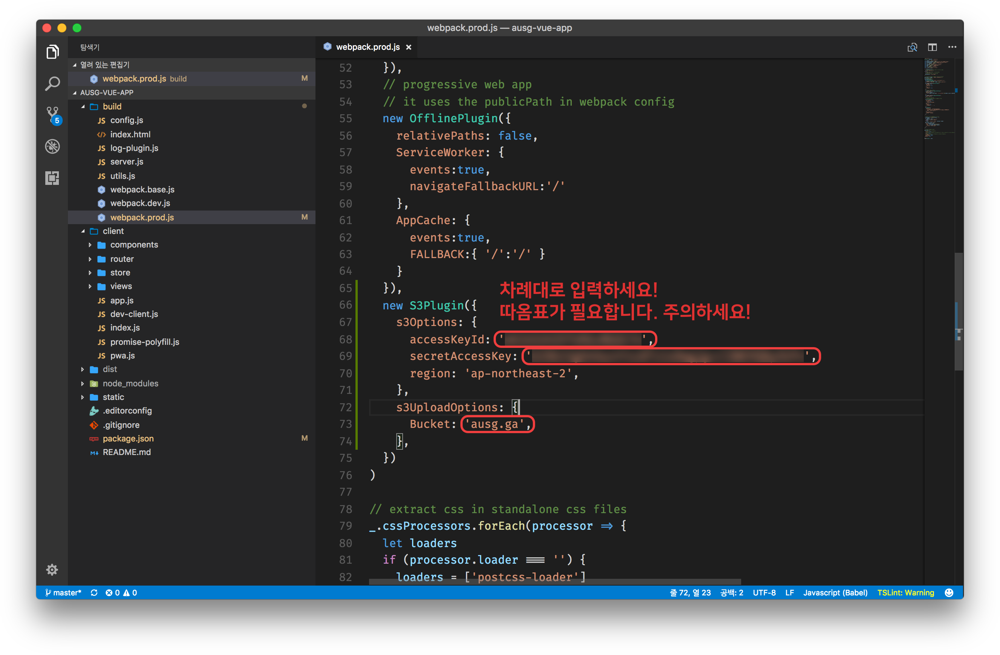
- 이제 다시 빌드하면, 빌드 완료된 번들 파일(HTML, CSS, JS)가 자동으로 S3에 업로드 됩니다

```
npm run build
```

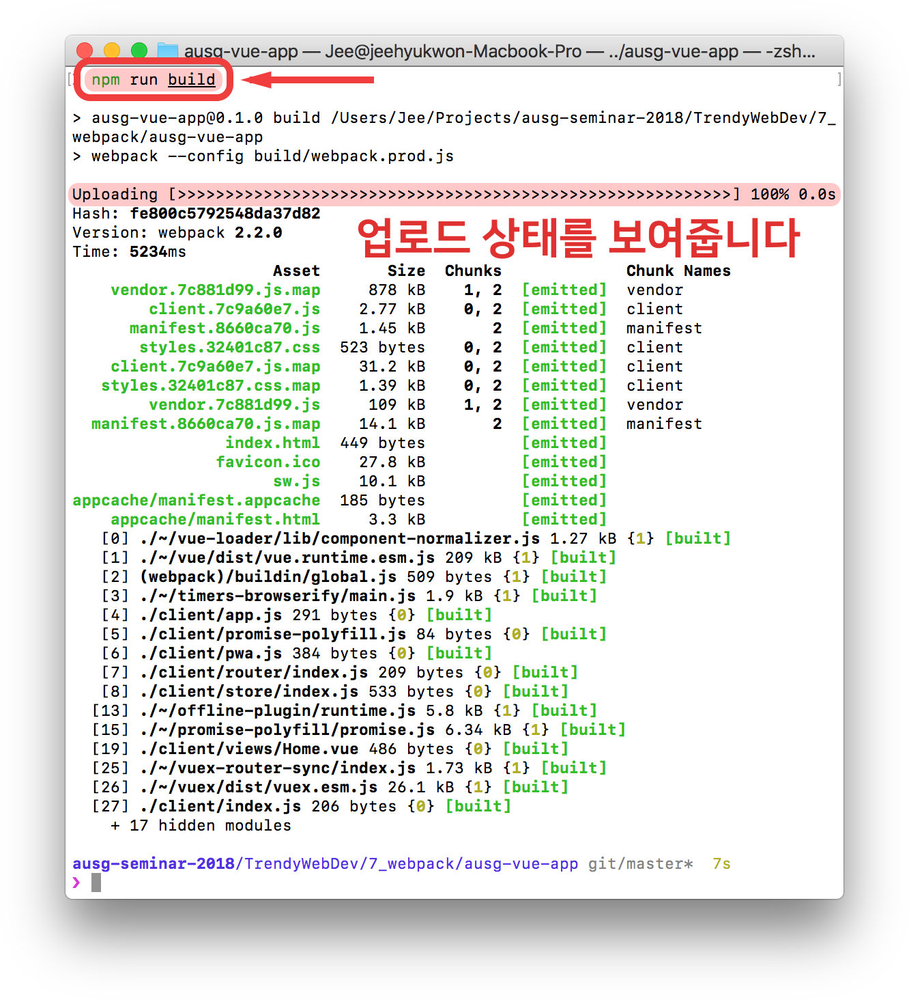

- 본인의 웹사이트로 이동해서 결과를 확인해봅니다.

### 수고하셨습니다! 실습 세션을 모두 마쳤습니다. Chapter 8. [삭제 가이드](../8_remove/)로 이동해, 그동안 만든 AWS 자원들을 차례대로 삭제하세요.