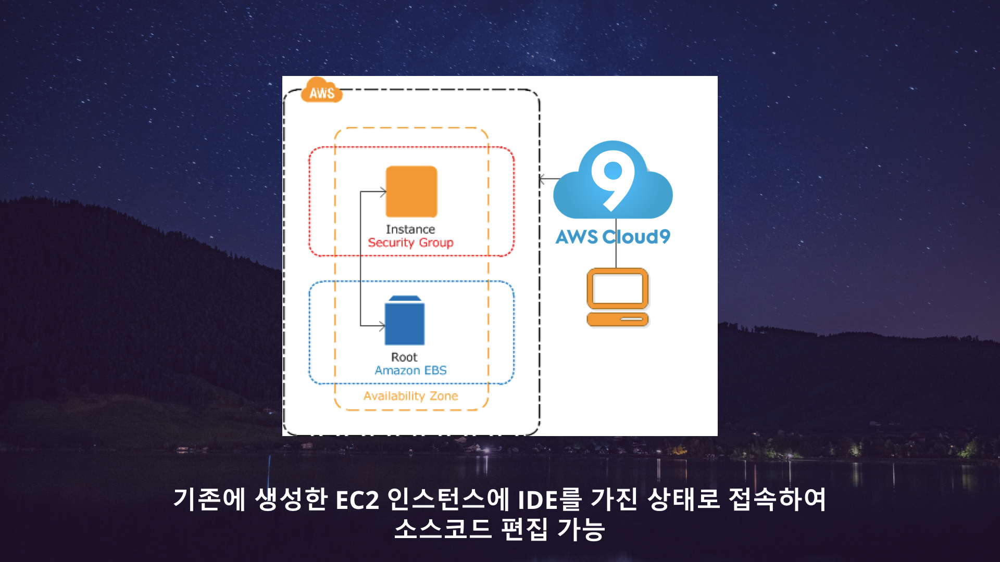

## 아키텍쳐 개요
이 모듈에서는 EC2를 콘솔에서 생성해보고, 생성했던 EC2에 C9으로 접속해 보는 실습을 진행합니다.
EC2를 SSH가 아니라 C9으로 접속하면, 여러명의 사용자가 동시편집이 가능하고 vim, linux 커맨드를 몰라도 손쉽게 작업할 수 있습니다.

## 준비
사용자가 만약 *Windows* 환경이라면 SSH에 접속하기 위하여 [Putty](https://www.chiark.greenend.org.uk/~sgtatham/putty/latest.html) 또는 [cygwin](https://cygwin.com/install.html)이 필요합니다. 설치 후 모듈을 진행하십시오. 
*MAC OS*라면 이미 ssh client가 세팅되어 있습니다. 모듈을 진행하십시오.

## Chapter 2. Cloud9 & EC2 접속
1. [AWS Console 서울](https://ap-northeast-2.console.aws.amazon.com/console/home?region=ap-northeast-2#)
2. **EC2** 선택
3. **인스턴스 시작** 선택
4. **Ubuntu Server 16.04 LTS (HVM), SSD Volume Type** 선택
5. **t2.micro** 선택
6. **검토 및 시작** 선택
7. **시작** 선택
8. **새 키 페어 생성** 선택
9. **키 페어 이름** 에 **c9connect** 입력
10. **키 페어 다운로드** 선택
11. **인스턴스 시작** 선택 -> **인스턴스 보기 선택**
12. **로컬 터미널**에서 다운로드 받은 pem키에 다음 명령어를 입력함으로써 권한 변경 `chmod 400 c9connect.pem` -> 권한변경 (Mac OS, Linux 만 가능)
13. 인스턴스를 선택하고 우측 하단의 **IPv4 퍼블릭 IP** 의 ip를 복사해둡니다. -> 이후에 사용할 것임.(ex. `13.124.12.140`)
14. 인스턴스 선택후, **연결** 선택
15. ssh로 시작하는 커맨드 복사 (ex. `ssh -i "c9connect.pem" ubuntu@ec2-13-125-1-37.ap-northeast-2.compute.amazonaws.com`)
16. **로컬 터미널**에서 15. 에서 복사한 커맨드 실행 -> yes 타이핑 -> 접속이 완료되면, 터미널을 그대로 열어둔다.
17. EC2에 접속되면 **Ec2 터미널**에서 `sudo apt-get update`
18. **Ec2 터미널**에서 `sudo apt-get install nodejs-legacy` -> *LTS, Current 버전 말고 legacy nodeJS 설치* -> *C9에서 ssh로 ec2에 접근하기 위함*
19. **Ec2 터미널**에서 `sudo apt-get install python2.7` 파이썬 설치
20. **Ec2 터미널**에서 `sudo apt-get install python-pip python-dev python-setuptools` 파이썬 종속성 설치
21. [AWS Cloud9 랜딩 페이지 Amazon Web Services](https://aws.amazon.com/ko/cloud9/) 페이지에 접속합니다.
22. **AWS Cloud9 시작하기** 선택
23. **아시아 태평양 (싱가포르)** 선택
24. 주황색 **Create environment** 선택
25.  **Name** 칸에 `c9connect` 를 적고 우측 하단 **Next step** 선택
26. **Environment type** 에 **Connect and run in remote server (SSH)** 선택
27. **User** 에 `ubuntu` 입력
28. **Host** 에 13. 에서 복사해둔 EC2 인스턴스의 `ip`를 입력
29. **Copy key to Clipboard**를 입력
30. **이전에 열어둔 EC2에 접속되어있는 터미널**에서 `vi ~/.ssh/authorized_keys` 입력 -> `esc연타` 후에, `$` 입력하면 현재 라인끝으로 이동
31. 맨 끝에 `ctr + v` 붙여넣기
32. `esc연타` 후에 -> `:wq`로 저장
33. c9 생성 페이지에서 **Next Step** 선택
34. **Create Environment** 선택
35. **Next**를 계속 선택 -> Cloud9 CLI를 설치하는 과정
36. c9이 다 만들어지면, **c9 터미널** `grep . /etc/*-release` 입력 -> 명령어로 os가 `Ubuntu`임을 확인
37. **c9 터미널**에서 `mkdir helloc9` 입력 -> 디렉토리를 만듬
38. **이전 열어둔 Ec2 터미널**에서 `ls` 입력 -> c9에서 만든 디렉토리가  현재 ec2에 연결되어 있음을 확인

실습이 완료되면 다음모듈인 [Chapter 3. C9 친구와 작업하기](../3_c9withFriends) 으로 이동하십시오
